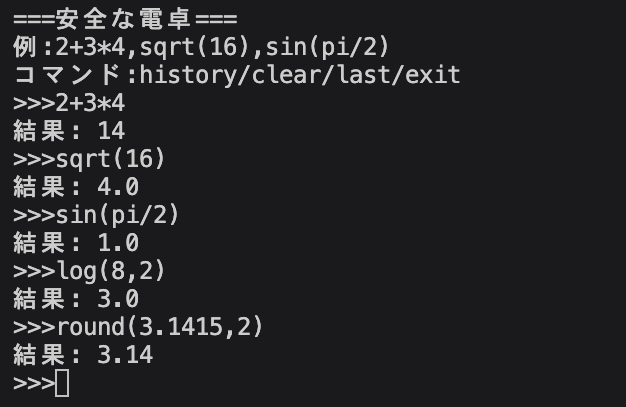

# safe-calculator
Pythonのastを使って安全に数式を評価する電卓です。

## 概要
通常のevalを作った電卓は任意コード実行の危険がありますがastを使い、許可された構文のみを評価することで安全性を確保しています。

## 機能
- 四則演算(+ - * / **)
- 数学関数(sin,cos,tan,log,sqrt,exp など)
- 定数(pi,e)
- 履歴機能
- ana(直前の結果を再利用)

## 工夫した点
- evalを使わず、astで構文解析を行った
- 実行可能なノードを制限し、安全性を確保
- 関数ごとに引数の数をチェックし、誤使用を防止

## 苦労した点
- astのノード構造の理解
- Nameノード(pi,e)の対応
- 関数の引数チェック設計

## 使用例

2+3*4=14
sin(pi/2)=1.0
log(8,2)=3.0
